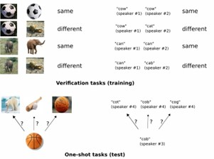
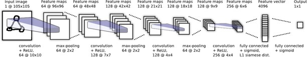

# One-shot Facial Recognition with Siamese Networks

  

Implementation of "Siamese Neural Networks for One-shot Image Recognition" in PyTorch.  This project demonstrates one-shot learning for facial recognition, achieving high accuracy with limited data.

## A. Paper Idea

### 1. Overview

This project implements a Siamese Neural Network, as described in the paper by Koch, Zemel, and Salakhutdinov, for one-shot facial recognition.  Instead of requiring large datasets for each identity, our model learns a similarity function that can accurately distinguish between faces even when presented with only *one* example of a new identity.  This is achieved by training the network on pairs of images, learning to determine whether the pairs belong to the same person or different people.

  <!-- Thay thế bằng hình ảnh tổng quan về mạng Siamese, nếu có -->

**Key Concepts:**

*   **Siamese Network:**  A neural network architecture consisting of two (or more) identical sub-networks that share weights.  These networks process different inputs and produce feature vectors, which are then compared using a distance metric.
*   **One-shot Learning:**  The ability to learn and classify new categories based on only one (or very few) training examples.
*   **Verification Task:**  The network is trained on a verification task, where it learns to discriminate between same-identity and different-identity image pairs.
*   **Convolutional Neural Network (CNN):**  We use a CNN architecture to extract robust and discriminative features from the input images.

### 2. Training

The Siamese network is trained on pairs of face images.  Each pair is labeled as either "same" (images of the same person) or "different" (images of different people). The network learns to map images to a feature space where similar faces are close together and dissimilar faces are far apart.  A contrastive loss or cross-entropy loss (on a sigmoid output) is typically used.

 

### 3. Inference (One-shot Classification)

To perform one-shot classification, we are given:

*   A *test image* of an unknown person.
*   A *support set* containing one image of each of *C* known people.

The Siamese network compares the test image to each image in the support set, producing a similarity score for each pair. The predicted identity is the person in the support set whose image has the highest similarity score to the test image.

 <!-- Thay bằng hình ảnh mô tả quá trình inference -->

<!-- ## B. Instructions

### 1. Data Preparation

This project utilizes the LFW (Labeled Faces in the Wild) dataset, modified for one-shot learning.  You can download a preprocessed version of the dataset here: [data](https://drive.google.com/file/d/1w1YDoRdDsdLhm3xiH2HQj0C_z-CHtowt)

*The structure of the download folder:* -->