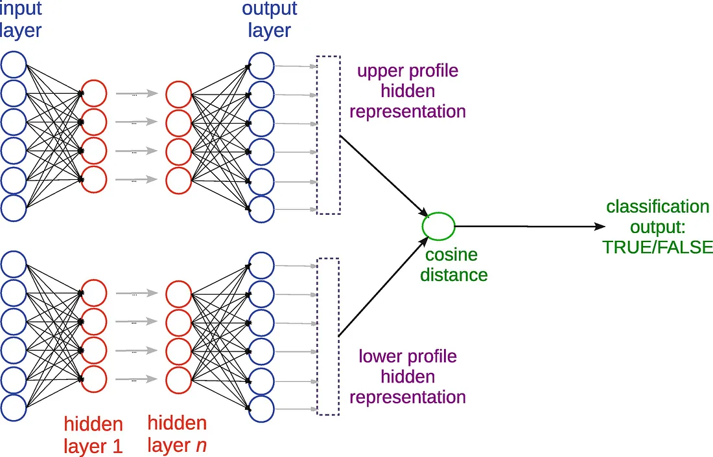

# Nhận dạng chữ viết tay một lần bằng Mạng Siamese Neural

[](https://www.cs.cmu.edu/~rsalakhu/papers/oneshot1.pdf)

Dự án này triển khai **Mạng Siamese Neural Network** để nhận dạng chữ viết tay trong bài toán học một lần (one-shot learning), dựa trên bài báo *"Siamese Neural Networks for One-shot Image Recognition"* của Koch, Zemel và Salakhutdinov. Mô hình được huấn luyện trên tập dữ liệu **Omniglot**, đạt độ chính xác ~92% trong bài toán phân loại một lần 20 lớp, cho phép nhận diện các ký tự mới từ các bảng chữ cái chưa từng thấy chỉ với một ví dụ cho mỗi ký tự.

## Mục lục
- [Tổng quan](#tổng-quan)
- [Ý tưởng chính](#ý-tưởng-chính)
- [Cài đặt](#cài-đặt)
- [Chuẩn bị dữ liệu](#chuẩn-bị-dữ-liệu)
- [Huấn luyện mô hình](#huấn-luyện-mô-hình)
- [Suy luận](#suy-luận)
- [Kết quả](#kết-quả)
- [Mở rộng](#mở-rộng)
- [Tài liệu tham khảo](#tài-liệu-tham-khảo)
- [Liên hệ](#liên-hệ)

## Tổng quan
Dự án triển khai một mạng Siamese Neural để giải quyết bài toán nhận dạng chữ viết tay một lần. Thay vì yêu cầu nhiều mẫu dữ liệu cho mỗi lớp ký tự, mô hình học một hàm đo lường độ tương đồng để phân biệt các cặp hình ảnh (giống hoặc khác ký tự). Sau khi huấn luyện trên bài toán xác minh, các đặc trưng học được được sử dụng để phân loại các ký tự mới mà không cần huấn luyện lại.

Mô hình được xây dựng bằng **PyTorch**, sử dụng kiến trúc convolutional và tập dữ liệu **Omniglot**, một tập dữ liệu chuẩn cho bài toán học một lần với 50 bảng chữ cái và hơn 1600 ký tự, mỗi ký tự được vẽ bởi 20 người.
 

## Ý tưởng chính
- **Mạng Siamese**: Hai mạng convolutional giống nhau, chia sẻ trọng số, xử lý hai hình ảnh đầu vào và tạo ra các vector đặc trưng. Khoảng cách L1 có trọng số giữa các vector được đưa qua hàm sigmoid để dự đoán xem cặp hình ảnh có cùng lớp hay không.
- **Học một lần**: Phân loại một hình ảnh thử nghiệm vào một trong 20 lớp ký tự chỉ với một ví dụ cho mỗi lớp.
- **Bài toán xác minh**: Huấn luyện trên các cặp hình ảnh được gắn nhãn “giống” hoặc “khác” để học các đặc trưng phân biệt.
- **Tăng cường dữ liệu**: Sử dụng biến đổi affine (xoay, cắt, tỷ lệ, dịch chuyển) để tăng độ bền của mô hình.

Mô hình đạt **92% độ chính xác** trên bài toán phân loại một lần 20 lớp của Omniglot, vượt qua hầu hết các mô hình cơ sở, chỉ đứng sau Hierarchical Bayesian Program Learning (HBPL, 95.5%).

## Cài đặt
### Yêu cầu
- Python 3.8+
- PyTorch 2.0+
- Torchvision
- NumPy
- Matplotlib (cho trực quan hóa)
- Optuna (cho tinh chỉnh siêu tham số)

### Cài đặt môi trường
1. Tạo môi trường ảo:
   ```bash
   python -m venv venv
   source venv/bin/activate  # Linux/Mac
   venv\Scripts\activate     # Windows
   ```
2. Cài đặt các thư viện:
   ```bash
   pip install torch torchvision numpy matplotlib optuna
   ```

## Chuẩn bị dữ liệu
- **Tập dữ liệu**: Sử dụng **Omniglot** (liên hệ Brenden Lake tại `brenden@cs.nyu.edu` để yêu cầu dữ liệu). Tập dữ liệu bao gồm 50 bảng chữ cái, chia thành:
  - **Background set**: 40 bảng chữ cái cho huấn luyện và xác minh.
  - **Evaluation set**: 10 bảng chữ cái cho kiểm tra một lần.
- **Tiền xử lý**:
  - Hình ảnh là nhị phân 105x105 pixel.
  - Giảm kích thước xuống 35x35 (tùy chọn) để tăng hiệu quả tính toán.
  - Tạo các cặp huấn luyện (30k, 90k, hoặc 150k cặp) với nhãn “giống” hoặc “khác”.
- **Tăng cường dữ liệu**: Áp dụng biến đổi affine ngẫu nhiên:
  - Xoay: ±10°
  - Cắt: ±0.3
  - Tỷ lệ: 0.8–1.2
  - Dịch chuyển: ±2 pixel
  - Xác suất áp dụng mỗi biến đổi: 50%

## Huấn luyện mô hình
1. **Kiến trúc mô hình**:
   - Nhiều tầng convolutional (16–256 bộ lọc, kích thước 3x3 đến 20x20, ReLU, max-pooling).
   - Tầng fully-connected (128–4096 đơn vị).
   - Tầng cuối: Tính khoảng cách L1 giữa các vector đặc trưng, sigmoid để dự đoán.
   - Mã mẫu (`model.py`):
     ```python
     import torch
     import torch.nn as nn

     class SiameseNet(nn.Module):
         def __init__(self):
             super(SiameseNet, self).__init__()
             self.cnn = nn.Sequential(
                 nn.Conv2d(1, 64, kernel_size=10), nn.ReLU(),
                 nn.MaxPool2d(2),
                 nn.Conv2d(64, 128, kernel_size=7), nn.ReLU(),
                 nn.MaxPool2d(2),
                 nn.Conv2d(128, 128, kernel_size=4), nn.ReLU(),
                 nn.MaxPool2d(2),
                 nn.Conv2d(128, 256, kernel_size=4), nn.ReLU()
             )
             self.fc = nn.Sequential(
                 nn.Linear(256 * 6 * 6, 4096), nn.ReLU(),
                 nn.Linear(4096, 1), nn.Sigmoid()
             )

         def forward_once(self, x):
             x = self.cnn(x)
             x = x.view(x.size(0), -1)
             return x

         def forward(self, x1, x2):
             out1 = self.forward_once(x1)
             out2 = self.forward_once(x2)
             dist = torch.abs(out1 - out2)
             return self.fc(dist)
     ```
2. **Hàm mất mát**: Cross-entropy với điều chuẩn L2:
     
3. **Siêu tham số**:
   - Tốc độ học: \(10^{-4}\) đến \(10^{-1}\), giảm 1% mỗi epoch.
   - Momentum: 0.5, tăng tuyến tính đến 1.0.
   - Điều chuẩn L2: \(0\) đến \(0.1\).
   - Minibatch: 128.
4. **Huấn luyện**:
   - Sử dụng SGD với momentum.
   - Theo dõi lỗi xác minh một lần trên 320 tác vụ.
   - Dừng nếu không cải thiện sau 20 epoch.
   - Tinh chỉnh siêu tham số bằng Optuna.
   ```bash
   python train.py --data_path /path/to/omniglot --batch_size 128 --epochs 200
   ```

## Suy luận
- **Tác vụ**: Phân loại một lần 20 lớp.
- **Quy trình**:
  - Đầu vào: Hình ảnh thử nghiệm và tập hỗ trợ (20 hình ảnh, mỗi lớp 1 hình).
  - Tính điểm tương đồng giữa hình ảnh thử nghiệm và từng hình ảnh hỗ trợ.
  - Dự đoán lớp có điểm tương đồng cao nhất.
- **Mã mẫu** (`inference.py`):
  ```python
  def one_shot_inference(model, test_img, support_imgs):
      model.eval()
      with torch.no_grad():
          scores = []
          for support_img in support_imgs:
              score = model(test_img, support_img)
              scores.append(score)
          pred_class = torch.argmax(torch.tensor(scores))
      return pred_class
  ```

## Kết quả
- **Độ chính xác**:
  - Omniglot (20-way one-shot): **92%** (so với HBPL: 95.5%, 1-NN: 21.7%).
  - MNIST (10-way one-shot, không tinh chỉnh): **70.3%** (so với 1-NN: 26.5%).
- **Hiệu suất xác minh** (Omniglot):
  - 150k cặp, có biến đổi affine: **93.42%**.
  - 30k cặp, không biến đổi: **90.61%**.

## Mở rộng
- **Biến đổi nét vẽ**: Áp dụng biến đổi affine ở cấp độ nét vẽ (xem Hình 8 trong bài báo) để tăng độ bền đặc trưng.
- **Tổng quát hóa**: Kiểm tra trên các tập dữ liệu khác như MNIST hoặc EMNIST.
- **Cải tiến kiến trúc**: Thử nghiệm các kiến trúc hiện đại hơn (ResNet, Vision Transformer) trong mạng Siamese.
- **Tối ưu hóa**: Sử dụng các bộ tối ưu hóa tiên tiến (Adam, AdamW) thay vì SGD.

## Tài liệu tham khảo
- Koch, G., Zemel, R., & Salakhutdinov, R. (2015). *Siamese Neural Networks for One-shot Image Recognition*. Proceedings of the 32nd International Conference on Machine Learning.
- Lake, B. M., Salakhutdinov, R., & Tenenbaum, J. B. (2011). *One-shot learning of simple visual concepts*. Proceedings of the 33rd Annual Conference of the Cognitive Science Society.
- Omniglot dataset: [Liên hệ Brenden Lake](mailto:brenden@cs.nyu.edu).

## Liên hệ
Nếu bạn có câu hỏi hoặc cần hỗ trợ, vui lòng mở issue trên repository này hoặc liên hệ qua email: [dhuyhoang181@gmail.com].

---